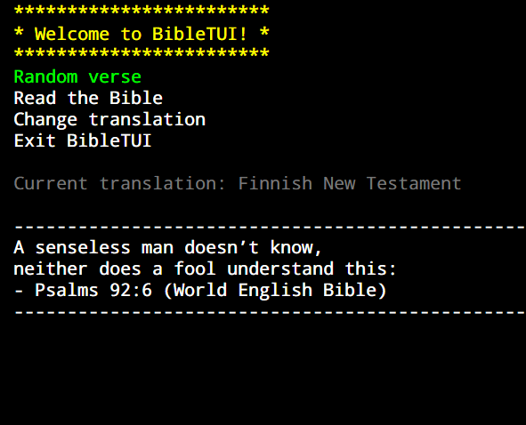

# BibleTUI

## Description
- Get different Bible translations from API.Bible in a multitude of languages!
- Read them in the command line!
- Keep a record of your favourite 

## How to use
1.  Go to the [API Bible page](https://scripture.api.bible/)
2.  Create a new account to get a new api key.
3.  Create a 'getApiKey' function in the internal/api_query package. The function should return your api key as a string.
4.  Use 'go build .' to build the executable.
5.  Run your BibleTUI!

## Bugs
- Viewport does not scroll to the end of the chapter properly.
  - Linebreak count issue
  - Temporary solution: Add a set amount of linebreaks at the end of each displayed chapter.

